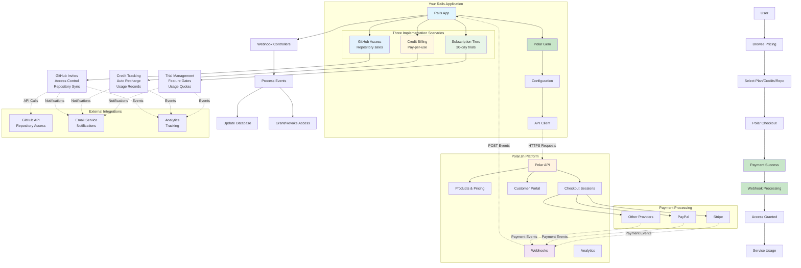

# Polar Ruby SDK

A comprehensive Ruby API wrapper for [Polar.sh](https://polar.sh) - the modern billing platform for digital products. This gem provides a clean, Rails-compatible interface for managing customers, subscriptions, payments, and benefits through the Polar API.

## Features

- 🔧 **Full API Coverage**: Complete access to Polar's customers, products, subscriptions, checkouts, orders, and benefits APIs
- 🛡️ **Rails Compatible**: Follows Rails conventions and integrates seamlessly with Rails applications
- ⚡ **Hotwire Ready**: Includes Stimulus controller examples for frontend integration
- 🔄 **Automatic Retries**: Built-in retry logic for robust API interactions
- 🧪 **Well Tested**: Comprehensive test suite with WebMock and Mocha
- 📝 **Type Safety**: Ruby signatures included for better development experience

## Installation

Add this line to your application's Gemfile(make sure to specify gem source):

```ruby
gem 'polar', github: "repaera/polar-ruby"
```

And then execute:

```bash
bundle install
```

## Setup & Configuration

### Prerequisites

Before using this gem, you need to set up both your Polar.sh dashboard and Rails application.

#### 1. Polar.sh Dashboard Setup

1. **Create a Polar.sh Account**
   - Sign up at [polar.sh](https://polar.sh) if you haven't already
   - Complete your organization setup

2. **Generate API Access Token**
   - Go to Settings → Scroll bottom then click *New Token*
   - Create a new API key with the required scopes:
     - `products:read` and `products:write`
     - `customers:read` and `customers:write`
     - `subscriptions:read` and `subscriptions:write`
     - `checkouts:read` and `checkouts:write`
     - `orders:read`
     - `benefits:read` and `benefits:write`
   - Copy the access token (keep it secure!)

3. **Create Products**
   - Navigate to Products in your dashboard
   - Create products for your offerings (subscriptions, one-time purchases, etc.)
   - Note the Product IDs - you'll need these in your Rails app
   - Set up pricing for each product

4. **Configure Webhooks**
   - Go to Settings → Webhooks, then click *Add Endpoint*
   - Add your Rails app's webhook endpoint: `https://yourapp.com/webhooks/polar`
   - Select the events you want to receive:
     - `subscription.created`, `subscription.updated`, `subscription.cancelled`
     - `order.completed`
     - `customer.updated`
     - `benefit.granted`, `benefit.revoked`
   - Copy the webhook signing secret for verification

5. **Set Up Customer Portal (Optional)**
   - Configure your customer portal settings
   - Set return URLs for your application

#### 2. Rails Application Setup

1. **Add Environment Variables**
   
   Add to your Rails credentials or environment variables:
   
   ```yaml
   # config/credentials.yml.enc (Rails 7.0+)
   polar:
     access_token: "polar_pat_your_access_token_here"
     webhook_secret: "whsec_your_webhook_secret_here"
     
   # Product IDs from your Polar dashboard
   polar_products:
     starter_monthly: "prod_starter_monthly_id"
     pro_monthly: "prod_pro_monthly_id"
     enterprise_monthly: "prod_enterprise_monthly_id"
   ```
   
   Or use environment variables:
   ```bash
   # .env (if using dotenv gem)
   POLAR_ACCESS_TOKEN=polar_pat_your_access_token_here
   POLAR_WEBHOOK_SECRET=whsec_your_webhook_secret_here
   POLAR_STARTER_MONTHLY_PRODUCT_ID=prod_starter_monthly_id
   POLAR_PRO_MONTHLY_PRODUCT_ID=prod_pro_monthly_id
   POLAR_ENTERPRISE_MONTHLY_PRODUCT_ID=prod_enterprise_monthly_id
   ```

2. **Database Migrations**
   
   Generate and run migrations for your chosen scenario(example):
   
   ```bash
   # For subscription tiers scenario
   rails generate migration CreateUsers first_name:string last_name:string email:string:uniq current_tier:string trial_started_at:datetime trial_ends_at:datetime polar_customer_id:string onboarding_completed:boolean
   rails generate migration CreateSubscriptions user:references polar_subscription_id:string:uniq polar_product_id:string tier:string status:string amount:decimal currency:string billing_interval:string current_period_start:datetime current_period_end:datetime trial_start:datetime trial_end:datetime cancelled_at:datetime cancel_at_period_end:boolean metadata:json
   rails generate migration CreateUsageQuotas user:references tier:string projects_limit:integer team_members_limit:integer storage_limit_bytes:bigint api_calls_limit:integer projects_used:integer team_members_used:integer storage_used_bytes:bigint api_calls_used:integer
   rails generate migration CreateTierDefinitions name:string:uniq display_name:string description:text monthly_price:decimal yearly_price:decimal polar_monthly_product_id:string polar_yearly_product_id:string projects_limit:integer team_members_limit:integer storage_limit_bytes:bigint api_calls_limit:integer features:json active:boolean featured:boolean sort_order:integer
   
   # For credit billing scenario
   rails generate migration AddCreditFieldsToUsers credit_balance:decimal auto_recharge_enabled:boolean auto_recharge_threshold:decimal auto_recharge_amount:decimal total_credits_purchased:decimal total_credits_consumed:decimal last_recharge_at:datetime
   rails generate migration CreateCreditPackages name:string description:text credits:decimal price:decimal currency:string polar_product_id:string active:boolean featured:boolean sort_order:integer expires_at:datetime max_purchases_per_user:integer metadata:json
   rails generate migration CreateCreditTransactions user:references credit_package:references transaction_type:string amount:decimal balance_before:decimal balance_after:decimal description:text reference_id:string polar_order_id:string polar_transaction_id:string operation_type:string processed_at:datetime status:string metadata:json
   
   # For GitHub access scenario  
   rails generate migration AddGithubFieldsToUsers github_username:string github_id:string github_access_token:text github_connected_at:datetime
   rails generate migration CreateGithubRepositories github_id:string:uniq name:string full_name:string owner:string description:text html_url:string clone_url:string ssh_url:string private:boolean language:string stars_count:integer forks_count:integer price:decimal currency:string polar_product_id:string access_expires_at:datetime active:boolean metadata:json
   rails generate migration CreateRepositoryPackages name:string description:text price:decimal currency:string polar_product_id:string access_duration:string active:boolean featured:boolean sort_order:integer metadata:json
   rails generate migration CreateRepositoryAccesses user:references github_repository:references repository_package:references access_level:string status:string granted_at:datetime expires_at:datetime revoked_at:datetime revoked_reason:text purchase_reference:string polar_order_id:string access_source:string invitation_accepted_at:datetime last_accessed_at:datetime access_count:integer
   
   rails db:migrate
   ```

3. **Create Initializer**

   ```ruby
   # config/initializers/polar.rb
   Polar.configure do |config|
     config.access_token = Rails.application.credentials.dig(:polar, :access_token) || ENV['POLAR_ACCESS_TOKEN']
     config.environment = Rails.env.production? ? :production : :sandbox
     config.timeout = 30
     config.retries = 3
   end
   ```

4. **Add Routes**
   
   ```ruby
   # config/routes.rb
   Rails.application.routes.draw do
     # Webhook endpoints
     post '/webhooks/polar', to: 'webhooks#polar'
     
     # API endpoints for frontend
     namespace :api do
       namespace :polar do
         resources :checkouts, only: [:create]
         post :customer_portal, to: 'customers#portal_session'
       end
     end
     
     # Your application routes
     resources :subscriptions, only: [:index, :new, :create, :show, :destroy]
     resources :pricing, only: [:index]
     get '/billing', to: 'billing#index'
   end
   ```

5. **Install Stimulus (if using Hotwire)**
   
   ```bash
   # If not already installed
   rails hotwire:install
   
   # Copy the provided Stimulus controllers to your app
   # scenarios/*/stimulus/ controllers → app/javascript/controllers/
   ```

### Quick Start

#### 1. Basic Configuration

With the setup complete, verify your configuration:

```ruby
# Test your configuration in Rails console
rails console

# Verify API connection
client = Polar.client
customer = client.customers.list(limit: 1)
puts "✅ Polar API connection successful" if customer

# Test with your product IDs
products = client.products.list
puts "✅ Found #{products[:data]&.count || 0} products"
```

#### 2. Choose Your Implementation Scenario

This gem give three ideas for implementation scenarios:

**📊 Subscription Tiers** - For SaaS apps with monthly/yearly plans and trials
```bash
# Copy scenario files to your Rails app
cp -r examples/scenarios/subscription_tiers/* ./
rails runner examples/scenarios/subscription_tiers/seeds/tier_definitions.rb
```

**💳 Credit-Based Billing** - For usage-based services and API businesses  
```bash
# Copy scenario files to your Rails app
cp -r examples/scenarios/credit_billing/* ./
rails runner examples/scenarios/credit_billing/seeds/credit_packages.rb
```

**🔒 GitHub Repository Access** - For selling access to private code repositories
```bash
# Copy scenario files to your Rails app
cp -r examples/scenarios/github_access/* ./
rails runner examples/scenarios/github_access/seeds/github_repositories.rb
```

Each scenario includes models, controllers, Stimulus controllers, webhooks, and seed data.

#### 3. Basic Usage

```ruby
# Get the configured client
client = Polar.client

# Create a customer
customer = client.customers.create({
  email: "customer@example.com",
  external_id: "user_123"
})

# Create a checkout session
checkout = client.checkouts.create({
  product_id: "your_product_id", # Use your actual product ID from Polar dashboard
  customer: {
    email: "customer@example.com"
  },
  success_url: "https://yourapp.com/success",
  cancel_url: "https://yourapp.com/cancel"
})

# Redirect user to checkout.url
redirect_to checkout["url"]
```

## Architecture Overview

Copy and paste this Mermaid code into an online Mermaid editor to visualize the complete Polar.sh gem architecture:



This diagram shows how the Polar gem integrates with your Rails application, connects to Polar.sh services, processes payments, and handles the three different billing scenarios.

#### 4. Testing Your Setup

After setup, test your integration:

```bash
# Test webhook endpoint (in development)
# Use ngrok or similar to expose your local server
ngrok http 3000

# Add the ngrok URL to Polar webhook settings:
# https://your-ngrok-url.ngrok.io/webhooks/polar

# Test a purchase flow
rails server
# Visit localhost:3000/pricing and test a purchase
```

#### 5. Production Deployment

Before going live:

1. **Update Polar Environment**
   ```ruby
   # config/initializers/polar.rb
   config.environment = :production # Change from :sandbox
   ```

2. **Use Production Access Token**
   - Generate a production API key in Polar dashboard
   - Update your credentials/environment variables

3. **Update Webhook URL**
   - Change webhook URL to your production domain
   - Verify webhook signature validation is enabled

4. **Test Production Flow**
   - Create test purchases with real payment methods
   - Verify webhooks are received and processed correctly

## API Reference

### Customers

```ruby
client = Polar.client

# List customers
customers = client.customers.list(limit: 10, page: 1)

# Retrieve a customer
customer = client.customers.retrieve("customer_id")

# Create a customer
customer = client.customers.create({
  email: "user@example.com",
  external_id: "user_123",
  name: "John Doe",
  metadata: { source: "rails_app" }
})

# Update a customer
updated = client.customers.update("customer_id", { name: "Jane Doe" })

# Delete a customer
client.customers.delete("customer_id")

# Lookup by email
results = client.customers.lookup_by_email("user@example.com")

# Create customer portal session
portal = client.customers.portal_session("customer_id", 
  return_url: "https://yourapp.com/dashboard"
)
```

### Products

```ruby
# List products
products = client.products.list(organization_id: "org_id")

# Retrieve a product
product = client.products.retrieve("product_id")

# Create a product
product = client.products.create({
  name: "Premium Plan",
  description: "Access to premium features",
  prices: [
    {
      amount: 2900, # $29.00 in cents
      currency: "USD",
      recurring_interval: "month"
    }
  ]
})

# Update a product
updated = client.products.update("product_id", { name: "Updated Plan" })

# Get product benefits
benefits = client.products.benefits("product_id")
```

### Subscriptions

```ruby
# List subscriptions
subscriptions = client.subscriptions.list(customer_id: "customer_id")

# Retrieve a subscription
subscription = client.subscriptions.retrieve("subscription_id")

# Cancel a subscription
cancelled = client.subscriptions.cancel("subscription_id", 
  cancel_at_period_end: true
)

# Reactivate a cancelled subscription
reactivated = client.subscriptions.reactivate("subscription_id")

# Change subscription product
changed = client.subscriptions.change_product("subscription_id", 
  "new_product_id",
  price_id: "price_id"
)

# Export subscription benefits
benefits = client.subscriptions.export_benefits("subscription_id")
```

### Checkouts

```ruby
# Create a basic checkout
checkout = client.checkouts.create({
  product_id: "product_id",
  success_url: "https://yourapp.com/success",
  cancel_url: "https://yourapp.com/cancel",
  customer: {
    email: "customer@example.com"
  }
})

# Create custom checkout with validation
checkout = client.checkouts.create_custom({
  product_id: "product_id",
  # ... other options
})

# Retrieve checkout
checkout = client.checkouts.retrieve("checkout_id")

# Expire a checkout
expired = client.checkouts.expire("checkout_id")

# Create subscription tier upgrade
upgrade = client.checkouts.create_subscription_tier_upgrade(
  customer_id: "customer_id",
  subscription_id: "subscription_id", 
  subscription_tier_id: "tier_id"
)
```

### Orders

```ruby
# List orders
orders = client.orders.list(customer_id: "customer_id")

# Retrieve an order
order = client.orders.retrieve("order_id")

# Get order invoice
invoice = client.orders.invoice("order_id")

# Orders by customer
customer_orders = client.orders.by_customer("customer_id")

# Orders by subscription
subscription_orders = client.orders.by_subscription("subscription_id")
```

### Benefits

```ruby
# List benefits
benefits = client.benefits.list(organization_id: "org_id")

# Retrieve a benefit
benefit = client.benefits.retrieve("benefit_id")

# Create a benefit
benefit = client.benefits.create({
  type: "github_repository",
  description: "Access to private repository",
  properties: {
    repository_name: "myorg/private-repo"
  }
})

# Update a benefit
updated = client.benefits.update("benefit_id", { 
  description: "Updated description" 
})

# Delete a benefit
client.benefits.delete("benefit_id")

# Grant benefit to customer
grant = client.benefits.grant("benefit_id", 
  customer_id: "customer_id"
)

# List benefit grants
grants = client.benefits.grants("benefit_id")

# Revoke benefit grant
client.benefits.revoke_grant("benefit_id", "grant_id")
```

## Rails Integration

### Models

Here's how to integrate Polar with your Rails models:

```ruby
class User < ApplicationRecord
  has_many :subscriptions, dependent: :destroy

  def polar_customer
    @polar_customer ||= find_or_create_polar_customer
  end

  def active_subscription?
    subscriptions.active.exists?
  end

  def subscription_benefits
    return [] unless active_subscription?
    active_subscription.product_benefits
  end

  def create_portal_session(return_url: nil)
    customer = polar_customer
    return nil unless customer

    Polar.client.customers.portal_session(
      customer["id"],
      return_url: return_url || dashboard_url
    )
  rescue Polar::APIError => e
    Rails.logger.error "Failed to create portal session: #{e.message}"
    nil
  end

  private

  def find_or_create_polar_customer
    result = Polar.client.customers.lookup_by_email(email)
    
    if result[:data].present?
      result[:data].first
    else
      Polar.client.customers.create({
        email: email,
        external_id: id.to_s,
        name: full_name
      })
    end
  rescue Polar::APIError => e
    Rails.logger.error "Failed to find/create Polar customer: #{e.message}"
    nil
  end
end

class Subscription < ApplicationRecord
  belongs_to :user
  
  scope :active, -> { where(status: ["active", "trialing"]) }

  def cancel!(at_period_end: true)
    result = Polar.client.subscriptions.cancel(polar_subscription_id, 
      cancel_at_period_end: at_period_end
    )
    
    update!(
      status: result["status"],
      cancelled_at: Time.current
    )
  rescue Polar::APIError => e
    errors.add(:base, "Failed to cancel subscription: #{e.message}")
    false
  end
end
```

### Controllers

```ruby
class PaymentsController < ApplicationController
  before_action :authenticate_user!

  def new
    @checkout = create_checkout_session
    redirect_to @checkout["url"], allow_other_host: true
  end

  def success
    session_id = params[:session_id]
    checkout = Polar.client.checkouts.retrieve(session_id)
    
    if checkout["status"] == "completed"
      process_successful_payment(checkout)
      redirect_to dashboard_path, notice: "Payment successful!"
    else
      redirect_to pricing_path, alert: "Payment not completed"
    end
  rescue Polar::NotFoundError
    redirect_to pricing_path, alert: "Invalid checkout session"
  end

  def webhook
    # Handle Polar webhooks
    payload = request.body.read
    event = JSON.parse(payload)
    
    case event["type"]
    when "subscription.created"
      handle_subscription_created(event["data"])
    when "subscription.cancelled"
      handle_subscription_cancelled(event["data"])
    end
    
    head :ok
  end

  private

  def create_checkout_session
    Polar.client.checkouts.create({
      product_id: params[:product_id],
      customer: {
        email: current_user.email,
        external_id: current_user.id.to_s
      },
      success_url: payments_success_url + "?session_id={CHECKOUT_SESSION_ID}",
      cancel_url: payments_cancel_url
    })
  end
end
```

## Hotwire Stimulus Integration

This gem includes ready-to-use Stimulus controllers for seamless frontend integration:

### Checkout Controller

```javascript
// app/javascript/controllers/polar_checkout_controller.js
import { Controller } from "@hotwired/stimulus"

export default class extends Controller {
  static targets = ["button", "error"]
  static values = { productId: String, successUrl: String, cancelUrl: String }

  async createCheckout(event) {
    event.preventDefault()
    
    this.buttonTarget.disabled = true
    this.buttonTarget.textContent = "Creating checkout..."

    try {
      const response = await fetch("/api/polar/checkouts", {
        method: "POST",
        headers: {
          "Content-Type": "application/json",
          "X-CSRF-Token": this.csrfToken
        },
        body: JSON.stringify({
          product_id: this.productIdValue,
          success_url: this.successUrlValue,
          cancel_url: this.cancelUrlValue
        })
      })

      const data = await response.json()
      if (response.ok) {
        window.location.href = data.url
      } else {
        this.showError(data.error)
      }
    } catch (error) {
      this.showError("Network error occurred")
    }
  }

  get csrfToken() {
    return document.querySelector('meta[name="csrf-token"]')?.getAttribute("content")
  }
}
```

### HTML Usage

```html
<div data-controller="polar-checkout"
     data-polar-checkout-product-id-value="your_product_id"
     data-polar-checkout-success-url-value="/payments/success"
     data-polar-checkout-cancel-url-value="/payments/cancel">
  
  <button data-polar-checkout-target="button" 
          data-action="click->polar-checkout#createCheckout"
          class="btn btn-primary">
    Subscribe Now
  </button>

  <div data-polar-checkout-target="error" class="error-message hidden"></div>
</div>
```

### Customer Portal Controller

```javascript
// app/javascript/controllers/polar_customer_portal_controller.js
import { Controller } from "@hotwired/stimulus"

export default class extends Controller {
  static values = { customerId: String, returnUrl: String }

  async openPortal(event) {
    event.preventDefault()
    
    const response = await fetch("/api/polar/customer-portal", {
      method: "POST",
      headers: {
        "Content-Type": "application/json",
        "X-CSRF-Token": this.csrfToken
      },
      body: JSON.stringify({
        customer_id: this.customerIdValue,
        return_url: this.returnUrlValue
      })
    })

    const data = await response.json()
    if (response.ok) {
      window.open(data.url, "_blank")
    }
  }
}
```

## Error Handling

The gem provides specific error classes for different scenarios:

```ruby
begin
  customer = Polar.client.customers.retrieve("invalid_id")
rescue Polar::NotFoundError => e
  # Handle 404 errors
  Rails.logger.error "Customer not found: #{e.message}"
rescue Polar::AuthenticationError => e
  # Handle 401 errors
  Rails.logger.error "Invalid authentication: #{e.message}"
rescue Polar::RateLimitError => e
  # Handle 429 errors
  Rails.logger.error "Rate limit exceeded: #{e.message}"
rescue Polar::APIError => e
  # Handle any other API errors
  Rails.logger.error "API error: #{e.message} (Status: #{e.status})"
end
```

## Configuration Options

```ruby
Polar.configure do |config|
  # Required: Your Polar API access token
  config.access_token = "your_access_token"
  
  # Environment: :sandbox or :production (default: :sandbox)
  config.environment = :production
  
  # Request timeout in seconds (default: 30)
  config.timeout = 60
  
  # Number of retry attempts for failed requests (default: 3)
  config.retries = 5
end
```

## Testing

The gem includes comprehensive test helpers:

```ruby
# test/test_helper.rb
require "polar"
require "webmock/test_unit"

class ActiveSupport::TestCase
  def setup
    Polar.configure do |config|
      config.access_token = "test_token"
      config.environment = :sandbox
    end
  end

  def stub_polar_request(method, path, response_body: {}, status: 200)
    WebMock.stub_request(method, "https://sandbox-api.polar.sh#{path}")
           .to_return(
             status: status,
             body: response_body.to_json,
             headers: { "Content-Type" => "application/json" }
           )
  end
end
```

## Development

After checking out the repo, run `bin/setup` to install dependencies. Then, run `rake test` to run the tests. You can also run `bin/console` for an interactive prompt that will allow you to experiment.

To install this gem onto your local machine, run `bundle exec rake install`. To release a new version, update the version number in `version.rb`, and then run `bundle exec rake release`, which will create a git tag for the version, push git commits and the created tag, and push the `.gem` file to [rubygems.org](https://rubygems.org).

## Examples

Complete example files are available in the `examples/` directory:

- `examples/rails_controller.rb` - Complete Rails controller implementation
- `examples/rails_model.rb` - Rails model integration examples  
- `examples/rails_initializer.rb` - Configuration setup
- `examples/stimulus_controllers.js` - Hotwire Stimulus controllers
- `examples/html_templates.html` - HTML templates with Stimulus integration

### Complete Implementation Scenarios

The gem includes three complete, production-ready scenarios in `examples/scenarios/`:

- `examples/scenarios/subscription_tiers/` - SaaS subscription tiers with 30-day trials
- `examples/scenarios/credit_billing/` - Credit-based billing for usage-based services
- `examples/scenarios/github_access/` - GitHub repository access control system

Each scenario includes models, controllers, migrations, webhooks, Stimulus controllers, and seed data.

## Webhook Handling

Polar sends webhooks for various events. Here's how to handle them:

```ruby
# config/routes.rb
post '/webhooks/polar', to: 'webhooks#polar'

# app/controllers/webhooks_controller.rb
class WebhooksController < ApplicationController
  skip_before_action :verify_authenticity_token, only: [:polar]

  def polar
    payload = request.body.read
    signature = request.headers['Polar-Signature']
    
    # Verify webhook signature (implement according to Polar docs)
    event = JSON.parse(payload)
    
    case event['type']
    when 'subscription.created'
      handle_subscription_created(event['data'])
    when 'subscription.updated'
      handle_subscription_updated(event['data'])
    when 'subscription.cancelled'
      handle_subscription_cancelled(event['data'])
    when 'order.completed'
      handle_order_completed(event['data'])
    when 'benefit.granted'
      handle_benefit_granted(event['data'])
    when 'benefit.revoked'
      handle_benefit_revoked(event['data'])
    end
    
    head :ok
  rescue JSON::ParserError
    head :bad_request
  end
end
```

## Best Practices

### 1. Error Handling
Always wrap API calls in proper error handling:

```ruby
begin
  subscription = Polar.client.subscriptions.retrieve(subscription_id)
rescue Polar::NotFoundError
  # Handle missing subscription
rescue Polar::APIError => e
  # Handle other API errors
  Rails.logger.error "Polar API error: #{e.message}"
end
```

### 2. Caching
Cache expensive API calls when appropriate:

```ruby
def polar_customer
  Rails.cache.fetch("polar_customer_#{id}", expires_in: 1.hour) do
    find_or_create_polar_customer
  end
end
```

### 3. Background Jobs
Process webhooks and API calls in background jobs:

```ruby
class ProcessPolarWebhookJob < ApplicationJob
  def perform(event_data)
    case event_data['type']
    when 'subscription.created'
      # Handle subscription creation
    end
  end
end
```

### 4. Idempotency
Use external IDs to ensure idempotent operations:

```ruby
customer = Polar.client.customers.create({
  email: user.email,
  external_id: user.id.to_s, # Use your app's user ID
  name: user.name
})
```

## Troubleshooting

### Common Issues

**Authentication Errors**
- Verify your access token is correct
- Check that you're using the right environment (sandbox vs production)
- Ensure the token has the required scopes

**Rate Limiting**
- The gem automatically retries failed requests
- Implement exponential backoff for additional robustness
- Consider using background jobs for bulk operations

**Webhook Verification**
- Implement proper signature verification
- Use HTTPS endpoints for webhook URLs
- Handle duplicate webhook deliveries gracefully

### Debug Mode

Enable detailed logging:

```ruby
Polar.configure do |config|
  config.access_token = "your_token"
  config.environment = :sandbox
  # Add this for detailed HTTP logging
  HTTParty::Basement.default_options.update(debug_output: $stdout) if Rails.env.development?
end
```

## Contributing

Bug reports and pull requests are welcome on GitHub at https://github.com/repaera/polar-ruby. This project is intended to be a safe, welcoming space for collaboration, and contributors are expected to adhere to the [code of conduct](https://github.com/repaera/polar-ruby/blob/main/CODE_OF_CONDUCT.md).

## License

The gem is available as open source under the terms of the [MIT License](https://opensource.org/licenses/MIT).

## Code of Conduct

Everyone interacting in the Polar project's codebases, issue trackers, chat rooms and mailing lists is expected to follow the [code of conduct](https://github.com/repaera/polar-ruby/blob/main/CODE_OF_CONDUCT.md).
