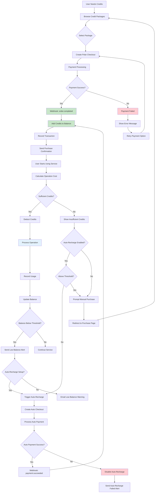

# Credit-Based Billing System

This scenario demonstrates a complete prepaid credit system where users purchase credit packages upfront and consume credits based on usage. Perfect for API businesses, AI services, and usage-based platforms.

## Business Model

- **Prepaid Credits**: Users purchase credit packages in advance
- **Usage-Based Consumption**: Credits deducted based on actual service usage
- **Volume Discounts**: Better rates for larger credit packages
- **Auto-Recharge**: Optional automatic credit purchases when balance is low

## Setup & Configuration

### 1. Polar.sh Dashboard Setup

1. **Create Credit Package Products**
   - Navigate to Products → Create Product
   - Create products for each credit package:
     - Starter Credits (1,000 credits - $10)
     - Professional Credits (5,000 credits - $40) 
     - Business Credits (15,000 credits - $105)
     - Enterprise Credits (50,000 credits - $300)
     - Holiday Bonus (7,500 credits - $40 - limited time)
   - Set up one-time purchase products (not subscriptions)
   - Note down all Product IDs

2. **Configure Package Metadata**
   - Add metadata to each product:
     - `credits_amount`: Number of credits in package
     - `package_type`: "credit_package"
     - `savings_percentage`: Discount compared to base rate
   - This metadata will be used by webhooks to process purchases

3. **Set Up Webhooks**
   - Add webhook endpoint: `https://yourapp.com/webhooks/polar/credits`
   - Subscribe to events:
     - `order.completed`
     - `payment.succeeded`
     - `payment.failed`
     - `refund.created`
     - `customer.updated`

### 2. Rails Application Setup

1. **Environment Variables**
   ```bash
   # Add to your .env or Rails credentials
   POLAR_CREDITS_STARTER_PRODUCT_ID=prod_credits_starter_xxx
   POLAR_CREDITS_PRO_PRODUCT_ID=prod_credits_pro_xxx
   POLAR_CREDITS_BUSINESS_PRODUCT_ID=prod_credits_business_xxx
   POLAR_CREDITS_ENTERPRISE_PRODUCT_ID=prod_credits_enterprise_xxx
   POLAR_CREDITS_BONUS_PRODUCT_ID=prod_credits_bonus_xxx
   ```

2. **Database Migrations**
   ```bash
   # Generate and run migrations
   rails generate migration AddCreditFieldsToUsers credit_balance:decimal auto_recharge_enabled:boolean auto_recharge_threshold:decimal auto_recharge_amount:decimal total_credits_purchased:decimal total_credits_consumed:decimal last_recharge_at:datetime
   
   rails generate migration CreateCreditPackages name:string description:text credits:decimal price:decimal currency:string polar_product_id:string active:boolean featured:boolean sort_order:integer expires_at:datetime max_purchases_per_user:integer metadata:json
   
   rails generate migration CreateCreditTransactions user:references credit_package:references transaction_type:string amount:decimal balance_before:decimal balance_after:decimal description:text reference_id:string polar_order_id:string polar_transaction_id:string operation_type:string processed_at:datetime status:string metadata:json
   
   rails generate migration CreateUsageRecords user:references credit_transaction:references operation_type:string operation_id:string credits_consumed:decimal cost_per_unit:decimal units_consumed:integer operation_details:json api_endpoint:string status:string started_at:datetime completed_at:datetime
   
   rails generate migration CreateCreditAlerts user:references alert_type:string trigger_balance:decimal current_balance:decimal message:text triggered_at:datetime email_sent:boolean email_sent_at:datetime status:string metadata:json
   
   rails db:migrate
   ```

3. **Copy Scenario Files**
   ```bash
   # Copy all scenario files to your Rails app
   cp -r examples/scenarios/credit_billing/models/* app/models/
   cp -r examples/scenarios/credit_billing/controllers/* app/controllers/
   cp -r examples/scenarios/credit_billing/services/* app/services/
   cp -r examples/scenarios/credit_billing/webhooks/* app/controllers/
   cp -r examples/scenarios/credit_billing/javascript/* app/javascript/controllers/
   ```

4. **Update Routes**
   ```ruby
   # config/routes.rb
   Rails.application.routes.draw do
     # Webhook endpoint
     post '/webhooks/polar/credits', to: 'credit_webhooks#polar_webhook'
     
     # Credit management
     resources :credits, only: [:index, :show] do
       collection do
         get :packages
         post :purchase
         get :history
         get :usage
       end
       member do
         post :auto_recharge_toggle
       end
     end
     
     # API endpoints for Stimulus controllers
     namespace :api do
       resources :credits, only: [:show] do
         collection do
           post :purchase
           post :consume
           get :balance
           get :usage_stats
         end
       end
     end
   end
   ```

5. **Seed Data**
   ```bash
   # Load credit packages and sample data
   rails runner examples/scenarios/credit_billing/seeds/credit_packages.rb
   ```

### 3. Frontend Setup (Optional)

1. **Add Stimulus Controller**
   ```bash
   # Copy the credit management Stimulus controller
   cp examples/scenarios/credit_billing/javascript/credit_management_controller.js app/javascript/controllers/
   ```

2. **Update Application Layout**
   ```erb
   <!-- app/views/layouts/application.html.erb -->
   <head>
     <!-- existing head content -->
     <%= stylesheet_link_tag "credit_billing", "data-turbo-track": "reload" %>
   </head>
   ```

## Usage Examples

### Basic Credit Flow

```ruby
# 1. Purchase credits
user = User.find_by(email: "user@example.com")

# Create checkout for credit purchase
package = CreditPackage.find_by(name: 'Professional Credits')
checkout = user.create_credit_purchase_checkout(package.id)
redirect_to checkout["url"]

# 2. Consume credits
cost_calculator = CreditCostCalculator.new
operation_cost = cost_calculator.calculate_cost('api_call', complexity: 'standard')

if user.consume_credits!(operation_cost, operation_type: 'api_call')
  # Process API request
  puts "API call processed. Remaining balance: #{user.credit_balance}"
else
  # Insufficient credits
  puts "Insufficient credits. Please purchase more."
end

# 3. Check balance and usage
puts "Current balance: #{user.credit_balance} credits"
puts "Total consumed today: #{user.daily_credit_consumption}"
puts "Auto-recharge enabled: #{user.auto_recharge_enabled?}"
```

### Auto-Recharge Setup

```ruby
# Enable auto-recharge
user.update!(
  auto_recharge_enabled: true,
  auto_recharge_threshold: 1000,    # Recharge when below 1000 credits
  auto_recharge_package: CreditPackage.find_by(name: 'Professional Credits')
)

# Auto-recharge triggers automatically when balance drops below threshold
user.consume_credits!(1500, operation_type: 'bulk_processing')
# This will trigger auto-recharge if balance was 2000 credits before consumption
```

### Usage Tracking and Analytics

```ruby
# Get usage statistics
stats = user.credit_usage_stats(period: :last_30_days)
puts "Total API calls: #{stats[:api_calls_count]}"
puts "Average cost per call: #{stats[:average_cost_per_call]}"
puts "Most expensive operation: #{stats[:highest_cost_operation]}"

# Get recent transactions
recent_transactions = user.credit_transactions.recent.limit(10)
recent_transactions.each do |transaction|
  puts "#{transaction.created_at}: #{transaction.transaction_type} - #{transaction.amount} credits"
end
```

## Flow Visualization

Copy and paste this Mermaid code into an online Mermaid editor to visualize the credit billing flow:



## Key Features

### Credit Management
- **Real-time balance tracking**: Instant updates after each operation
- **Usage analytics**: Detailed consumption reports and trends
- **Cost forecasting**: Predict monthly credit usage based on history
- **Bulk operations**: Batch processing with upfront credit reservation

### Billing Features
- **Flexible packages**: Multiple credit bundle options
- **Volume discounts**: Better rates for larger purchases
- **Rollover credits**: Unused credits carry forward
- **Auto-recharge**: Automatic credit purchases when balance is low

### Usage Tracking
- **Operation-level tracking**: Monitor consumption per API endpoint
- **Cost transparency**: Real-time cost calculation for each operation
- **Usage alerts**: Notifications for low balance and high consumption
- **Historical analysis**: Track usage patterns and optimize costs

## Credit Pricing Model

| Operation Type | Credit Cost | Description |
|---------------|-------------|-------------|
| Basic API Call | 1 credit | Simple data retrieval |
| Advanced API Call | 5 credits | Complex processing |
| Image Processing | 10 credits | Per image analyzed |
| AI Analysis | 25 credits | Machine learning operations |
| Large File Processing | 50 credits | Files > 10MB |
| Data Export | 15 credits | Per export operation |

## Credit Packages

| Package | Credits | Price | Price per Credit | Savings |
|---------|---------|-------|------------------|---------|
| Starter | 1,000 | $10.00 | $0.0100 | - |
| Professional | 5,000 | $40.00 | $0.0080 | 20% |
| Business | 15,000 | $105.00 | $0.0070 | 30% |
| Enterprise | 50,000 | $300.00 | $0.0060 | 40% |
| Holiday Bonus | 7,500 | $40.00 | $0.0053 | 47% (Limited) |

## Testing

### Test Credit Flow
```bash
# Create test user and purchase credits
rails console
user = User.create!(email: "test@example.com", first_name: "Test", last_name: "User")

# Test credit purchase
package = CreditPackage.find_by(name: 'Starter Credits')
checkout = user.create_credit_purchase_checkout(package.id)
puts checkout["url"]

# Simulate credit consumption
user.consume_credits!(100, operation_type: 'api_call', description: 'Test API call')
puts "Remaining balance: #{user.credit_balance}"

# Test auto-recharge
user.update!(auto_recharge_enabled: true, auto_recharge_threshold: 500)
user.consume_credits!(600, operation_type: 'bulk_processing')
# This should trigger auto-recharge if balance was under 1100
```

### Test Webhooks
```bash
# Use ngrok to expose local server
ngrok http 3000

# Update Polar webhook URL to: https://your-ngrok-url.ngrok.io/webhooks/polar/credits
# Test credit purchase in Polar dashboard
```

## Production Considerations

1. **Credit Security**
   - Implement proper transaction locking
   - Use database transactions for atomic operations
   - Monitor for unusual consumption patterns
   - Implement rate limiting per user

2. **Performance Optimization**
   - Cache credit balances for high-frequency operations
   - Use background jobs for non-critical credit operations
   - Implement efficient usage record storage
   - Optimize credit calculation algorithms

3. **Billing Accuracy**
   - Ensure atomic credit deduction and usage recording
   - Implement proper refund handling
   - Monitor for failed operations and credit restoration
   - Regular reconciliation of credit balances

4. **User Experience**
   - Real-time balance updates in UI
   - Clear cost estimation before operations
   - Proactive low balance notifications
   - Easy credit purchase flow

## Troubleshooting

### Common Issues

**Credits Not Added After Purchase**
- Check webhook is receiving order.completed events
- Verify credit package product ID mapping
- Check transaction processing in webhook handler

**Incorrect Credit Deduction**
- Verify cost calculation logic
- Check for proper atomic transactions
- Ensure usage records are created correctly

**Auto-Recharge Not Triggering**
- Check user auto-recharge settings
- Verify threshold and package configuration
- Check auto-recharge webhook processing

### Debug Commands
```bash
# Check user credit balance and transactions
user = User.find_by(email: "user@example.com")
puts "Balance: #{user.credit_balance}"
puts "Recent transactions:"
user.credit_transactions.recent.each { |t| puts "#{t.created_at}: #{t.transaction_type} #{t.amount}" }

# Check auto-recharge settings
puts "Auto-recharge enabled: #{user.auto_recharge_enabled?}"
puts "Threshold: #{user.auto_recharge_threshold}"
puts "Package: #{user.auto_recharge_package&.name}"

# Verify webhook events
tail -f log/development.log | grep "credit_webhook"
```