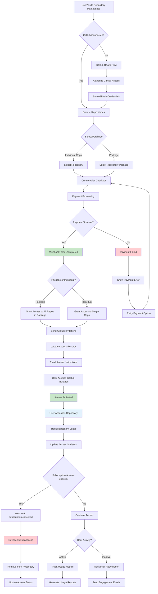

# GitHub Repository Access Control

This scenario demonstrates a complete system for selling access to private GitHub repositories, premium code libraries, and development tools. Perfect for indie developers, open source maintainers, and companies monetizing premium development resources.

## Business Model

- **Repository Packages**: Bundles of related repositories (e.g., Premium Dev Tools, Enterprise Framework Suite)
- **Individual Repository Access**: Single repository purchases for specific tools
- **Subscription Access**: Time-limited access to repositories or packages
- **One-time Purchases**: Permanent access to specific repositories

## Setup & Configuration

### 1. GitHub Setup

1. **Create GitHub App**
   - Go to GitHub → Settings → Developer settings → GitHub Apps
   - Create a new GitHub App for your application
   - Set webhook URL: `https://yourapp.com/webhooks/github`
   - Required permissions:
     - Repository access: Read & Write
     - Members: Write
     - Metadata: Read
   - Subscribe to events:
     - `member`
     - `membership`
     - `repository`
     - `push`
     - `release`

2. **GitHub OAuth Setup**
   - Create OAuth App in GitHub → Settings → Developer settings → OAuth Apps
   - Set Authorization callback URL: `https://yourapp.com/auth/github/callback`
   - Note Client ID and Client Secret

3. **Repository Preparation**
   - Create private repositories for your premium content
   - Set up repository collaborator permissions
   - Configure repository settings for access control

### 2. Polar.sh Dashboard Setup

1. **Create Repository Access Products**
   - Navigate to Products → Create Product
   - Create products for repository packages:
     - Premium Dev Tools Package ($29.99)
     - Enterprise Framework Suite ($99.99)
     - Starter Kit ($9.99)
   - Create individual repository products:
     - Premium CLI Tool ($15.00)
     - Debug Suite Pro ($25.00)
     - Enterprise Microservices Framework ($199.00)
   - Note down all Product IDs

2. **Configure Product Metadata**
   - Add metadata to link products to repositories:
     - `repository_id`: For individual repository access
     - `package_id`: For repository package access
     - `access_duration`: "permanent", "1_year", or "custom"
   - This metadata determines which repositories to grant access to

3. **Set Up Webhooks**
   - Add webhook endpoint: `https://yourapp.com/webhooks/polar/github`
   - Subscribe to events:
     - `order.completed`
     - `subscription.created`
     - `subscription.cancelled`
     - `refund.created`

### 3. Rails Application Setup

1. **Environment Variables**
   ```bash
   # Add to your .env or Rails credentials
   GITHUB_CLIENT_ID=your_github_oauth_client_id
   GITHUB_CLIENT_SECRET=your_github_oauth_client_secret
   GITHUB_APP_ID=your_github_app_id
   GITHUB_APP_PRIVATE_KEY=your_github_app_private_key
   GITHUB_WEBHOOK_SECRET=your_github_webhook_secret

   # Repository and package product IDs
   POLAR_TOOLS_PACKAGE_PRODUCT_ID=prod_tools_package_xxx
   POLAR_ENTERPRISE_PACKAGE_PRODUCT_ID=prod_enterprise_package_xxx
   POLAR_STARTER_PACKAGE_PRODUCT_ID=prod_starter_package_xxx
   POLAR_CLI_TOOL_PRODUCT_ID=prod_cli_tool_xxx
   POLAR_DEBUG_SUITE_PRODUCT_ID=prod_debug_suite_xxx
   ```

2. **Database Migrations**
   ```bash
   # Generate and run migrations
   rails generate migration AddGithubFieldsToUsers github_username:string github_id:string github_access_token:text github_connected_at:datetime
   
   rails generate migration CreateGithubRepositories github_id:string:uniq name:string full_name:string owner:string description:text html_url:string clone_url:string ssh_url:string private:boolean language:string stars_count:integer forks_count:integer price:decimal currency:string polar_product_id:string access_expires_at:datetime active:boolean metadata:json
   
   rails generate migration CreateRepositoryPackages name:string description:text price:decimal currency:string polar_product_id:string access_duration:string active:boolean featured:boolean sort_order:integer metadata:json
   
   rails generate migration CreateRepositoryAccesses user:references github_repository:references repository_package:references access_level:string status:string granted_at:datetime expires_at:datetime revoked_at:datetime revoked_reason:text purchase_reference:string polar_order_id:string access_source:string invitation_accepted_at:datetime last_accessed_at:datetime access_count:integer
   
   rails generate migration CreatePackageRepositories repository_package:references github_repository:references
   
   rails db:migrate
   ```

3. **Copy Scenario Files**
   ```bash
   # Copy all scenario files to your Rails app
   cp -r examples/scenarios/github_access/models/* app/models/
   cp -r examples/scenarios/github_access/services/* app/services/
   cp -r examples/scenarios/github_access/webhooks/* app/controllers/
   cp -r examples/scenarios/github_access/javascript/* app/javascript/controllers/
   ```

4. **Update Routes**
   ```ruby
   # config/routes.rb
   Rails.application.routes.draw do
     # GitHub OAuth
     get '/auth/github', to: 'sessions#github_oauth'
     get '/auth/github/callback', to: 'sessions#github_callback'
     
     # Webhook endpoints
     post '/webhooks/polar/github', to: 'github_access_webhooks#polar_webhook'
     post '/webhooks/github', to: 'github_access_webhooks#github_webhook'
     
     # Repository marketplace
     resources :repositories, only: [:index, :show] do
       member do
         post :purchase
         delete :revoke_access
       end
     end
     
     resources :repository_packages, only: [:index, :show] do
       member do
         post :purchase
       end
     end
     
     # User repository access management
     get '/my_repositories', to: 'repository_access#index'
     get '/repository_access/:id', to: 'repository_access#show'
   end
   ```

5. **Seed Data**
   ```bash
   # Load repository packages and sample data
   rails runner examples/scenarios/github_access/seeds/github_repositories.rb
   ```

### 4. Frontend Setup (Optional)

1. **Add Stimulus Controller**
   ```bash
   # Copy the repository access Stimulus controller
   cp examples/scenarios/github_access/javascript/repository_access_controller.js app/javascript/controllers/
   ```

2. **GitHub OAuth Integration**
   ```ruby
   # Add to your Gemfile
   gem 'omniauth'
   gem 'omniauth-github'
   gem 'omniauth-rails_csrf_protection'
   
   # Add to config/initializers/omniauth.rb
   Rails.application.config.middleware.use OmniAuth::Builder do
     provider :github, ENV['GITHUB_CLIENT_ID'], ENV['GITHUB_CLIENT_SECRET'],
              scope: 'user:email,read:org'
   end
   ```

## Usage Examples

### Basic Repository Access Flow

```ruby
# 1. User connects GitHub account
user = User.find_by(email: "developer@example.com")
user.connect_github_account(github_token, github_user_data)

# 2. Purchase repository access
package = RepositoryPackage.find_by(name: 'Premium Dev Tools')
checkout = user.create_repository_package_checkout(package.id)
redirect_to checkout["url"]

# 3. Grant access after purchase (handled by webhook)
package.github_repositories.each do |repo|
  repo.grant_access_to_user(
    user,
    access_level: 'read',
    expires_at: 1.year.from_now,
    access_source: 'package_purchase'
  )
end

# 4. Check user's repository access
user_repositories = user.accessible_repositories
user_repositories.each do |repo|
  puts "#{repo.name}: #{repo.access_status_for(user)}"
end
```

### GitHub Integration Management

```ruby
# Check if user has GitHub access token
if user.github_connected?
  puts "GitHub connected as: #{user.github_username}"
else
  # Redirect to GitHub OAuth
  redirect_to '/auth/github'
end

# Invite user to repository
repo = GithubRepository.find_by(name: 'premium-cli-tool')
access_manager = GitHubAccessManager.new
invitation = access_manager.invite_user_to_repository(user, repo)

# Check invitation status
if invitation.pending?
  puts "Invitation sent to #{user.github_username}"
elsif invitation.accepted?
  puts "Access granted to #{repo.name}"
end

# Revoke access
access_manager.revoke_user_access(user, repo, reason: 'Subscription expired')
```

### Repository Analytics

```ruby
# Track repository usage
repo = GithubRepository.find_by(name: 'debug-suite-pro')
analytics = repo.usage_analytics

puts "Total users with access: #{analytics[:total_users]}"
puts "Active users (last 30 days): #{analytics[:active_users]}"
puts "Average access frequency: #{analytics[:avg_access_frequency]}"

# User-specific analytics
user_access = user.repository_access_for(repo)
puts "Last accessed: #{user_access.last_accessed_at}"
puts "Total access count: #{user_access.access_count}"
```

## Flow Visualization

Copy and paste this Mermaid code into an online Mermaid editor to visualize the GitHub access flow:



## Key Features

### Repository Management
- **Multi-repository packages**: Single purchase grants access to multiple repos
- **Individual repository sales**: Sell access to specific repositories
- **Granular permissions**: Different access levels (read, write, admin)
- **Access expiration**: Time-limited access for subscriptions
- **Automatic invitations**: Send GitHub repository invites after purchase

### GitHub Integration
- **OAuth authentication**: Seamless GitHub login integration
- **Repository synchronization**: Keep repository data in sync
- **Webhook processing**: Handle GitHub and Polar events
- **Access automation**: Automatic invitation and revocation
- **Usage tracking**: Monitor repository access and activity

### Business Models
- **One-time purchases**: Permanent repository access
- **Subscription access**: Time-limited access with renewals
- **Package deals**: Bundles of related repositories
- **Tiered pricing**: Different packages for different user types

## Repository Product Types

| Package | Repositories | Price | Access Duration | Target Audience |
|---------|-------------|-------|-----------------|-----------------|
| Starter Kit | 2 repos | $9.99 | Permanent | Beginners |
| Premium Dev Tools | 2 repos | $29.99 | Permanent | Professional developers |
| Enterprise Suite | 2 repos | $99.99 | 1 Year | Enterprise teams |
| Individual Tools | 1 repo | $5-$199 | Permanent | Specific needs |

## Repository Examples

| Repository | Language | Price | Description |
|-----------|----------|-------|-------------|
| premium-cli-tool | TypeScript | $15.00 | Advanced CLI tool with premium features |
| debug-suite-pro | Python | $25.00 | Professional debugging suite |
| microservices-framework | Java | $199.00 | Enterprise microservices framework |
| monitoring-stack | Go | $149.00 | Complete monitoring solution |
| web-app-template | JavaScript | $5.00 | Beginner-friendly web app template |
| learning-examples | Multiple | $8.00 | Educational tutorials and examples |

## Testing

### Test Repository Access Flow
```bash
# Create test user and connect GitHub
rails console
user = User.create!(email: "dev@example.com", first_name: "Test", last_name: "Developer")

# Simulate GitHub OAuth connection
user.update!(
  github_username: "testdev",
  github_id: "gh_test_123",
  github_access_token: "encrypted_token",
  github_connected_at: Time.current
)

# Test package purchase
package = RepositoryPackage.find_by(name: 'Premium Dev Tools')
checkout = user.create_repository_package_checkout(package.id)
puts checkout["url"]

# Test repository access
repo = GithubRepository.find_by(name: 'premium-cli-tool')
access = user.repository_access_for(repo)
puts "Access status: #{access&.status || 'No access'}"
```

### Test Webhooks
```bash
# Use ngrok to expose local server
ngrok http 3000

# Update webhook URLs:
# Polar: https://your-ngrok-url.ngrok.io/webhooks/polar/github
# GitHub: https://your-ngrok-url.ngrok.io/webhooks/github

# Test repository purchase in Polar dashboard
# Test GitHub events by interacting with repositories
```

## Production Considerations

1. **GitHub API Limits**
   - Monitor API rate limits
   - Implement proper error handling for GitHub API failures
   - Use GitHub App authentication for higher limits
   - Cache repository data to reduce API calls

2. **Access Security**
   - Encrypt GitHub access tokens
   - Implement proper webhook signature verification
   - Monitor for unauthorized access patterns
   - Regular audit of repository permissions

3. **Scalability**
   - Use background jobs for GitHub API operations
   - Implement efficient repository access checking
   - Cache repository and access data
   - Monitor webhook processing performance

4. **User Experience**
   - Clear onboarding for GitHub connection
   - Helpful error messages for failed invitations
   - Easy access management interface
   - Proactive communication about access status

## Troubleshooting

### Common Issues

**GitHub Invitation Not Sent**
- Check if user has valid GitHub username
- Verify repository exists and is accessible
- Check GitHub API rate limits
- Ensure webhook processed successfully

**User Cannot Access Repository**
- Verify user accepted GitHub invitation
- Check repository access permissions
- Ensure access hasn't expired
- Verify repository is still private

**Webhook Processing Failures**
- Check webhook signature verification
- Verify product ID mappings
- Monitor webhook endpoint logs
- Ensure database transactions complete

### Debug Commands
```bash
# Check user's GitHub connection
user = User.find_by(email: "user@example.com")
puts "GitHub connected: #{user.github_connected?}"
puts "Username: #{user.github_username}"

# Check repository access
repo = GithubRepository.find_by(name: "premium-cli-tool")
access = user.repository_access_for(repo)
puts "Access status: #{access&.status}"
puts "Granted at: #{access&.granted_at}"
puts "Expires at: #{access&.expires_at}"

# Verify webhook events
tail -f log/development.log | grep "github_webhook"

# Check repository package associations
package = RepositoryPackage.find_by(name: "Premium Dev Tools")
puts "Repositories in package:"
package.github_repositories.each { |r| puts "- #{r.name}" }
```