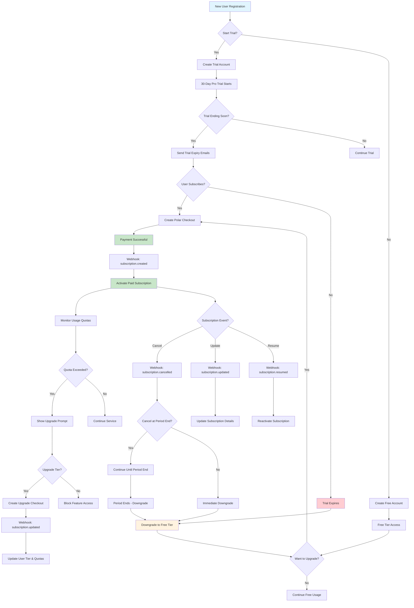

# Subscription Tiers with 30-Day Trials

This scenario demonstrates a complete SaaS subscription system with multiple pricing tiers, 30-day trial periods, and usage-based feature gating. Perfect for applications offering different service levels with trial periods.

## Business Model

- **Free Tier**: Limited features for trial-ended users
- **Starter Tier**: $9/month - Basic features for individuals
- **Pro Tier**: $29/month - Advanced features for growing teams (default trial tier)
- **Enterprise Tier**: $99/month - Full features for large organizations

Each paid tier includes a 30-day trial period with full access to tier features.

## Setup & Configuration

### 1. Polar.sh Dashboard Setup

1. **Create Subscription Products**
   - Navigate to Products → Create Product
   - Create products for each tier:
     - Starter Monthly ($9/month)
     - Starter Yearly ($90/year - 2 months free)
     - Pro Monthly ($29/month) 
     - Pro Yearly ($290/year - 2 months free)
     - Enterprise Monthly ($99/month)
     - Enterprise Yearly ($990/year - 2 months free)
   - Note down all Product IDs

2. **Configure Trial Settings**
   - Set trial period to 30 days for all paid products
   - Enable trial collection of payment method
   - Configure trial behavior in product settings

3. **Set Up Webhooks**
   - Add webhook endpoint: `https://yourapp.com/webhooks/polar`
   - Subscribe to events:
     - `subscription.created`
     - `subscription.updated` 
     - `subscription.cancelled`
     - `subscription.resumed`
     - `order.completed`
     - `customer.updated`

### 2. Rails Application Setup

1. **Environment Variables**
   ```bash
   # Add to your .env or Rails credentials
   POLAR_STARTER_MONTHLY_PRODUCT_ID=prod_starter_monthly_xxx
   POLAR_STARTER_YEARLY_PRODUCT_ID=prod_starter_yearly_xxx
   POLAR_PRO_MONTHLY_PRODUCT_ID=prod_pro_monthly_xxx
   POLAR_PRO_YEARLY_PRODUCT_ID=prod_pro_yearly_xxx
   POLAR_ENTERPRISE_MONTHLY_PRODUCT_ID=prod_enterprise_monthly_xxx
   POLAR_ENTERPRISE_YEARLY_PRODUCT_ID=prod_enterprise_yearly_xxx
   ```

2. **Database Migrations**
   ```bash
   # Generate and run migrations
   rails generate migration CreateUsers first_name:string last_name:string email:string:uniq current_tier:string trial_started_at:datetime trial_ends_at:datetime polar_customer_id:string onboarding_completed:boolean
   
   rails generate migration CreateSubscriptions user:references polar_subscription_id:string:uniq polar_product_id:string tier:string status:string amount:decimal currency:string billing_interval:string current_period_start:datetime current_period_end:datetime trial_start:datetime trial_end:datetime cancelled_at:datetime cancel_at_period_end:boolean metadata:json
   
   rails generate migration CreateUsageQuotas user:references tier:string projects_limit:integer team_members_limit:integer storage_limit_bytes:bigint api_calls_limit:integer projects_used:integer team_members_used:integer storage_used_bytes:bigint api_calls_used:integer
   
   rails generate migration CreateTierDefinitions name:string:uniq display_name:string description:text monthly_price:decimal yearly_price:decimal polar_monthly_product_id:string polar_yearly_product_id:string projects_limit:integer team_members_limit:integer storage_limit_bytes:bigint api_calls_limit:integer features:json active:boolean featured:boolean sort_order:integer
   
   rails db:migrate
   ```

3. **Copy Scenario Files**
   ```bash
   # Copy all scenario files to your Rails app
   cp -r examples/scenarios/subscription_tiers/models/* app/models/
   cp -r examples/scenarios/subscription_tiers/controllers/* app/controllers/
   cp -r examples/scenarios/subscription_tiers/services/* app/services/
   cp -r examples/scenarios/subscription_tiers/webhooks/* app/controllers/
   cp -r examples/scenarios/subscription_tiers/javascript/* app/javascript/controllers/
   ```

4. **Update Routes**
   ```ruby
   # config/routes.rb
   Rails.application.routes.draw do
     # Webhook endpoint
     post '/webhooks/polar', to: 'polar_webhooks#subscription_webhook'
     
     # Subscription management
     resources :subscriptions, only: [:index, :show, :create, :destroy] do
       member do
         post :cancel
         post :reactivate
         post :change_tier
       end
     end
     
     # Pricing and billing
     get '/pricing', to: 'pricing#index'
     get '/billing', to: 'billing#index'
     
     # API endpoints for Stimulus controllers
     namespace :api do
       resources :subscriptions, only: [:create, :update, :destroy]
       get '/usage', to: 'usage#show'
     end
   end
   ```

5. **Seed Data**
   ```bash
   # Load tier definitions and sample data
   rails runner examples/scenarios/subscription_tiers/seeds/tier_definitions.rb
   ```

### 3. Frontend Setup (Optional)

1. **Add Stimulus Controller**
   ```bash
   # Copy the subscription management Stimulus controller
   cp examples/scenarios/subscription_tiers/javascript/subscription_management_controller.js app/javascript/controllers/
   ```

2. **Update Application Layout**
   ```erb
   <!-- app/views/layouts/application.html.erb -->
   <head>
     <!-- existing head content -->
     <%= stylesheet_link_tag "subscription_tiers", "data-turbo-track": "reload" %>
   </head>
   ```

## Usage Examples

### Basic Subscription Flow

```ruby
# 1. Start a trial (typically during user registration)
user = User.create!(
  email: "user@example.com",
  first_name: "John",
  last_name: "Doe"
)

# Start Pro tier trial (default)
TrialManager.start_trial(user, tier: 'pro')

# 2. Check trial status
if user.trial_active?
  puts "Trial expires in #{user.trial_days_remaining} days"
end

# 3. Create checkout for subscription
checkout = user.create_subscription_checkout(
  tier: 'pro',
  billing_interval: 'monthly'
)
redirect_to checkout["url"]

# 4. Check feature access
if FeatureGate.can_access?(user, :advanced_analytics)
  # Show advanced analytics
end

# 5. Monitor usage
user.usage_quota.update!(projects_used: user.projects.count)
if user.usage_quota.projects_limit_exceeded?
  # Show upgrade prompt
end
```

### Subscription Management

```ruby
# Cancel subscription
subscription = user.active_subscription
subscription.cancel!(at_period_end: true)

# Upgrade/downgrade tier
user.change_subscription_tier('enterprise', billing_interval: 'yearly')

# Check subscription status
if user.subscription_active?
  current_tier = user.current_tier
  next_billing = user.active_subscription.current_period_end
end
```

## Flow Visualization

Copy and paste this Mermaid code into an online Mermaid editor to visualize the subscription flow:



## Key Features

### Trial Management
- **Automatic Trial Start**: New users get 30-day Pro trial
- **Trial Notifications**: Email reminders at 7, 3, and 1 day before expiry
- **Grace Period**: 3-day grace period after trial expiry
- **Trial Analytics**: Track trial conversion rates

### Usage Monitoring
- **Real-time Quota Tracking**: Monitor projects, team members, storage, API calls
- **Soft Limits**: Warning notifications at 80% usage
- **Hard Limits**: Feature blocking when limits exceeded
- **Usage Analytics**: Track usage patterns per tier

### Subscription Lifecycle
- **Seamless Upgrades**: Prorated billing for mid-cycle upgrades
- **Downgrades**: Applied at next billing cycle
- **Cancellation**: Option for immediate or end-of-period cancellation
- **Reactivation**: Easy subscription resumption

### Feature Gating
- **Dynamic Features**: Features enabled/disabled based on tier
- **Progressive Disclosure**: Show upgrade prompts for restricted features
- **Usage-based Access**: Features can be limited by usage quotas

## Key Features by Tier

| Feature | Free | Starter | Pro | Enterprise |
|---------|------|---------|-----|------------|
| Projects | 1 | 3 | 25 | Unlimited |
| Team Members | 1 | 1 | 10 | Unlimited |
| Storage | 100MB | 1GB | 10GB | 100GB |
| API Calls/month | 100 | 1,000 | 10,000 | 100,000 |
| Advanced Analytics | ❌ | ❌ | ✅ | ✅ |
| Priority Support | ❌ | ❌ | ❌ | ✅ |
| Custom Integrations | ❌ | ❌ | ✅ | ✅ |
| Team Collaboration | ❌ | ❌ | ✅ | ✅ |
| Export Data | ❌ | ✅ | ✅ | ✅ |
| White Labeling | ❌ | ❌ | ❌ | ✅ |

## Testing

### Test Trial Flow
```bash
# Create test user and start trial
rails console
user = User.create!(email: "test@example.com", first_name: "Test", last_name: "User")
TrialManager.start_trial(user, tier: 'pro')

# Simulate trial expiry
user.update!(trial_ends_at: 1.day.ago)
TrialManager.check_expired_trials

# Test subscription creation
checkout = user.create_subscription_checkout(tier: 'pro', billing_interval: 'monthly')
puts checkout["url"]
```

### Test Webhooks
```bash
# Use ngrok to expose local server
ngrok http 3000

# Update Polar webhook URL to: https://your-ngrok-url.ngrok.io/webhooks/polar
# Test subscription events in Polar dashboard
```

## Production Considerations

1. **Trial Abuse Prevention**
   - Implement email/IP tracking
   - Require payment method during trial
   - Monitor trial-to-paid conversion rates

2. **Usage Monitoring**
   - Implement background jobs for quota checking
   - Cache quota data for performance
   - Set up alerts for unusual usage patterns

3. **Billing Edge Cases**
   - Handle failed payments gracefully
   - Implement retry logic for webhook processing
   - Monitor subscription lifecycle events

4. **Customer Experience**
   - Clear trial expiry notifications
   - Seamless upgrade flows
   - Easy self-service cancellation

## Troubleshooting

### Common Issues

**Trial Not Starting**
- Check if user already had a trial
- Verify tier definition exists
- Check quota creation

**Subscription Not Activating**
- Verify webhook is receiving events
- Check Polar product ID mapping
- Ensure webhook signature verification

**Feature Access Issues**
- Verify user tier is updated correctly
- Check feature gate configuration
- Validate usage quota limits

### Debug Commands
```bash
# Check user trial status
User.find_by(email: "user@example.com").trial_status

# Verify webhook events
tail -f log/development.log | grep "webhook"

# Check subscription status
user.subscriptions.last.status
```